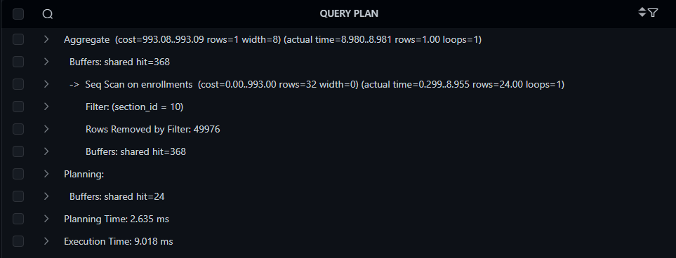
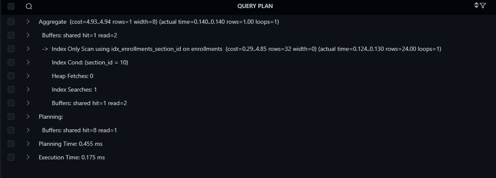
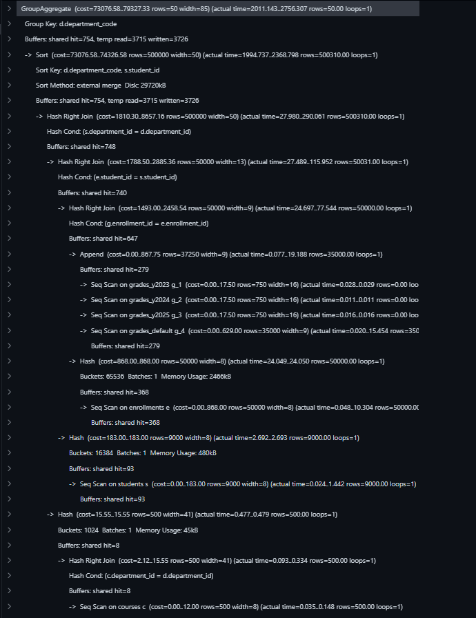
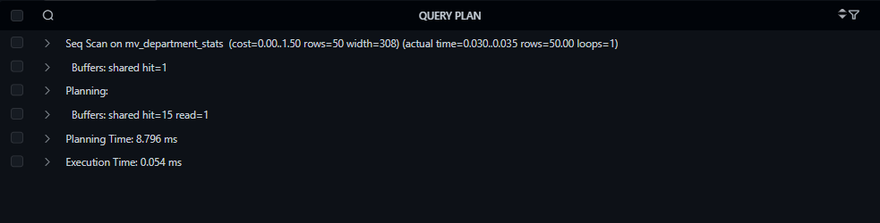

# University DB Optimization & Speed Up

This project modularizes and optimizes the `university` university database, focusing on schema scalability, query performance, and efficient data generation.

## Project Structure
* `sql/01_schema_setup.sql`: Base tables and ENUM types.
* `sql/02_indexing.sql`: B-Tree indexes and query planning tests.
* `sql/03_partitioning.sql`: Table partitioning for historical grade data.
* `sql/04_views.sql`: Materialized views for complex analytical queries.
* `sql/05_bulk_insert.sql`: Massive data generation scripts.
* `config/postgresql_tuned.conf`: Optimized server memory and I/O settings.

## Setup Instructions
1. Apply the tuned configurations to your `postgresql.conf` file and restart the server.
2. Execute the SQL scripts in order (01 through 05) using `psql` or your preferred IDE.
3. Record benchmark queries in `execution_plans.md`.

### 1. Table Partitioning: Historical Grades Data
By partitioning the `grades` table by year, the query planner utilizes partition pruning to skip scanning irrelevant data, significantly dropping execution times for historical queries.

| Before Partitioning (Full Table Scan) | After Partitioning (Partition Pruning) |
| :---: | :---: |
|  |  |

### 2. Materialized Views: Department Statistics
Complex, multi-table aggregations were converted into materialized views, shifting the processing load from on-the-fly calculation to instant, pre-computed reads.

| Before Materialized View (Heavy Joins) | After Materialized View (Instant Read) |
| :---: | :---: |
| (assets/before_mv2.png)  |  |
